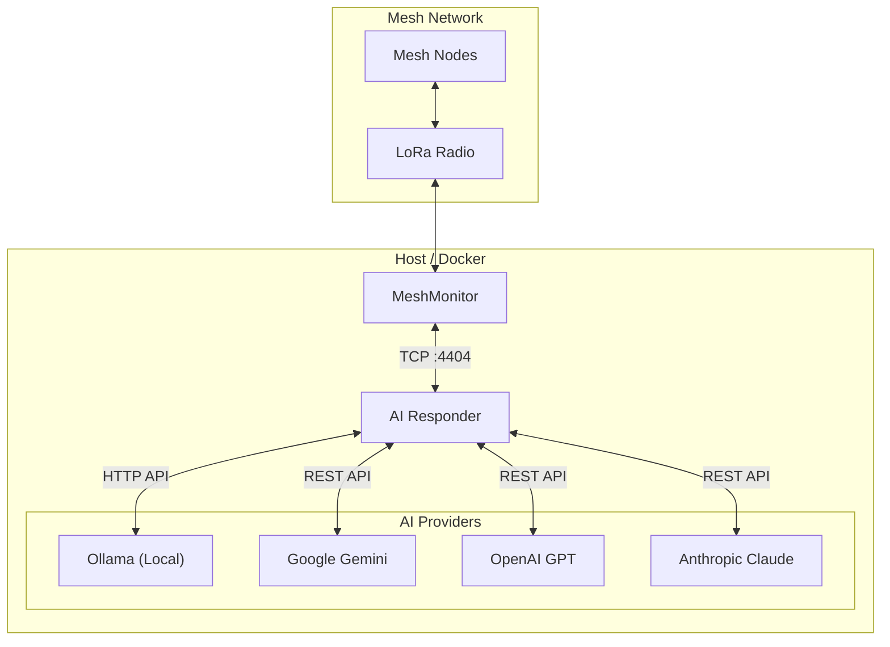
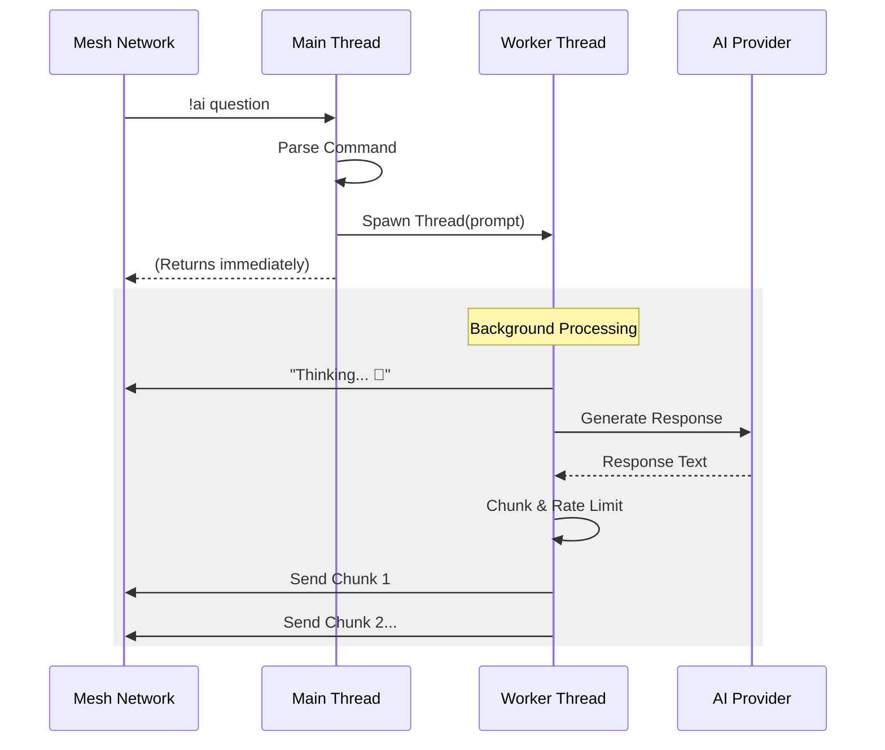

# Architecture

The `ai-responder` is a Python-based service designed to act as an autonomous agent on a Meshtastic network. It connects to the mesh via a TCP interface (typically provided by MeshMonitor) and processes messages addressed to it or broadcast commands.

## System Overview



## Core Components

### 1. TCP Interface
The application uses `meshtastic.tcp_interface.TCPInterface` to connect to a running Meshtastic node. In the recommended deployment, this connects to **MeshMonitor's Virtual Node**, allowing the AI bot to share the radio hardware with the monitoring system.

### 2. Event Loop & Packet Processing
The system uses a publish-subscribe model (`pubsub`) to handle incoming mesh packets.

- **`on_receive`**: The main callback for new packets.
    - Decodes the packet.
    - Checks if the channel is allowed.
    - Filters for commands (starting with `!ai`).
    - Dispatches to `process_command`.

### 3. Threading Model (Non-Blocking)
To prevent the main network interface from freezing during slow AI operations, all AI generation requests are offloaded to background threads.



### 4. Admin & Security
- **Admin Allowlist**: Sensitive commands (provider switching, configuration changes) are restricted to a list of trusted Node IDs.
- **Bootstrap Mode**: If no admins are configured, the system defaults to "Bootstrap Mode" where any user can claim admin status (intended for initial setup).

### 5. Response Management
Due to the low bandwidth of LoRa, responses are managed carefully:
- **Chunking**: Large responses are split into segments (default ~200 chars).
- **Rate Limiting**: A delay (default 30s) is enforced between chunks to avoid flooding the mesh.
- **Acknowledgments**: The system waits for an acknowledgement (ACK) from the mesh before considering a chunk sent (best-effort).

## Directory Structure

```
ai-responder/
├── ai_responder.py    # Main application entry point
├── config.py          # Configuration management
├── providers/         # AI provider implementations
│   ├── base.py        # Abstract base class
│   ├── ollama.py      # Local Ollama
│   ├── gemini.py      # Google Gemini
│   ├── openai.py      # OpenAI
│   └── anthropic.py   # Anthropic Claude
├── conversation/      # Conversation & session management
│   ├── manager.py     # Persistence & slots
│   └── session.py     # Session logic
├── meshtastic_handler/# Meshtastic interface
│   └── handler.py     # Message sending & rate limiting
├── requirements.txt   # Python dependencies
├── Dockerfile         # Container definition
├── README.md          # User documentation
├── ARCHITECTURE.md    # Architecture documentation (this file)
└── CONFIG.md          # Configuration reference
```
