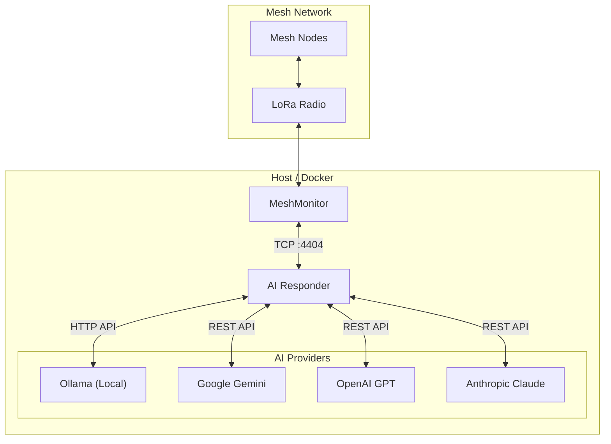
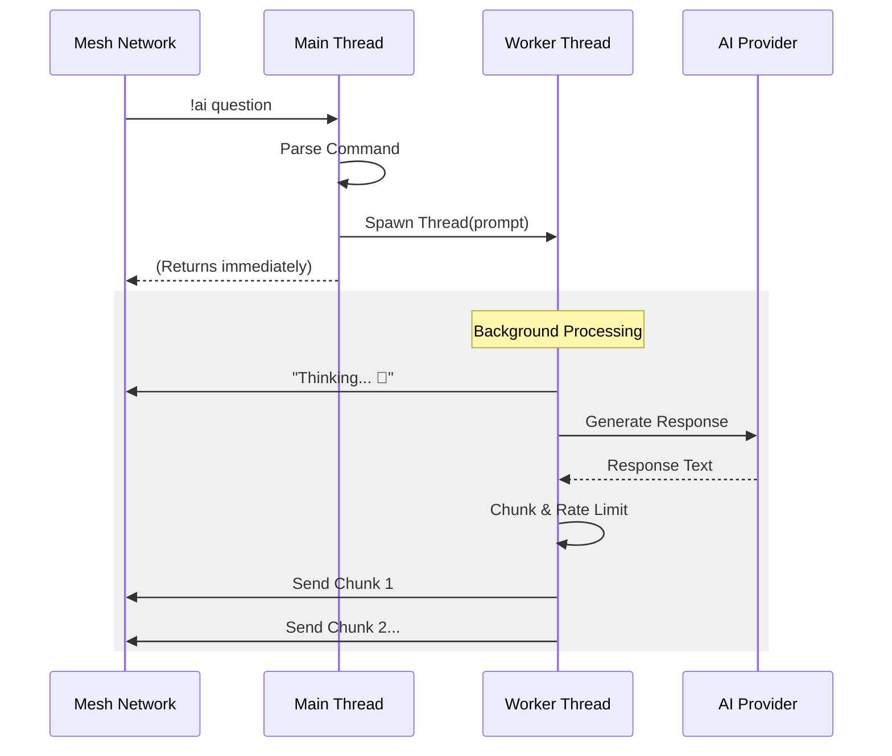

# Architecture

The `ai-responder` is a Python-based service designed to act as an autonomous agent on a Meshtastic network. It connects to the mesh via a TCP interface (typically provided by MeshMonitor) and processes messages addressed to it or broadcast commands.

## System Overview



## Core Components

### 1. Meshtastic Interface (`MeshtasticHandler`)
The application abstracts the connection to the radio via the `MeshtasticHandler` class. It supports:
- **TCP Connection**: (Default) Connects to a Meshtastic node or MeshMonitor via network.
- **Serial Connection**: Connects directly to a radio via USB.

### 2. Conversation & Session Management
Stateful interactions are managed by two core components:
- **`SessionManager`**: Handles DM-only continuous sessions. Tracks user inactivity (timeout: 5 min) and manages session state.
- **`ConversationManager`**: Handles long-term persistence. Stores up to 10 conversations per user as compressed JSON files (`.json.gz`), managing slots and metadata.

### 3. AI Provider System
An abstract base class (`BaseProvider`) defines the interface for all AI models. The factory pattern (`get_provider`) instantiates the configured provider:
- **Ollama**: Connects to local LLM inference.
- **Gemini / OpenAI / Anthropic**: Connects to cloud APIs.
- **Error Handling**: Standardized error reporting across all providers.

### 4. Event Loop & Packet Processing
The system uses a publish-subscribe model (`pubsub`) to handle incoming mesh packets.
- **`process_command`**: Main router for `!ai` commands.
- **`on_receive`**: Callback for incoming packets, filtering allowed channels and dispatching to session logic or command processor.

### 5. Threading Model (Non-Blocking)
To prevent the main network interface from freezing during slow AI operations, all AI generation requests are offloaded to background threads.



### 6. Admin & Security
- **Admin Allowlist**: Sensitive commands (provider switching, configuration changes) are restricted to a list of trusted Node IDs.
- **Bootstrap Mode**: If no admins are configured, the system defaults to "Bootstrap Mode" where any user can claim admin status (intended for initial setup).

### 7. Response Management
Managed by `MeshtasticHandler`:
- **Chunking**: Large responses are split at sentence boundaries.
- **Rate Limiting**: Dynamic delays (5s for DMs, 15s for Broadcasts) to prevent flooding.
- **Acknowledgments**: Waits for ACK for direct messages to ensure reliability.

## Directory Structure

```
ai-responder/
├── ai_responder.py    # Main application entry point
├── config.py          # Configuration management
├── providers/         # AI provider implementations
│   ├── base.py        # Abstract base class
│   ├── ollama.py      # Local Ollama
│   ├── gemini.py      # Google Gemini
│   ├── openai.py      # OpenAI
│   └── anthropic.py   # Anthropic Claude
├── conversation/      # Conversation & session management
│   ├── manager.py     # Persistence & slots
│   └── session.py     # Session logic
├── meshtastic_handler/# Meshtastic interface
│   └── handler.py     # Message sending & rate limiting
├── requirements.txt   # Python dependencies
├── Dockerfile         # Container definition
├── README.md          # User documentation
├── ARCHITECTURE.md    # Architecture documentation (this file)
└── CONFIG.md          # Configuration reference
```
