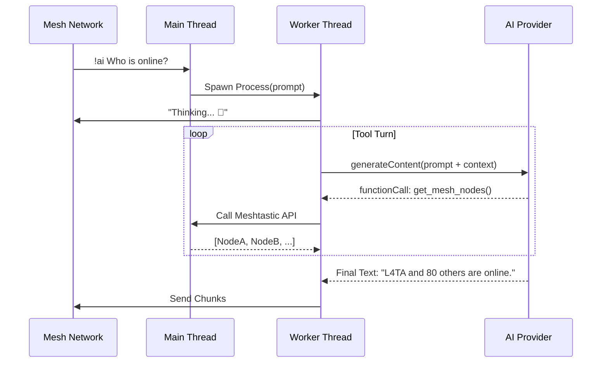

# Architecture

The `ai-responder` is a Python-based service designed to act as an autonomous agent on a Meshtastic network. It connects to the mesh via a TCP interface (typically provided by MeshMonitor) and processes messages addressed to it or broadcast commands.

## System Overview

```mermaid
graph TD
    subgraph Mesh Network
        Radio[LoRa Radio]
        Nodes[Mesh Nodes]
    end

    subgraph Host / Docker
        MM[MeshMonitor]
        AI[AI Responder Router]
        
        subgraph MCP Servers
            Internal[Internal Meshtastic]
            External[External Plugins e.g. MemPalace]
        end
        
        subgraph AI Providers
            Ollama["Ollama (Local)"]
            Gemini["Google Gemini"]
            OpenAI["OpenAI GPT"]
            Claude["Anthropic Claude"]
        end
    end

    Radio <--> MM
    MM <-->|TCP :4404| AI
    AI <--> MCP Servers
    AI <--Multi-Turn Loop-->|REST API| Gemini
    AI <--Multi-Turn Loop-->|HTTP API| Ollama
    Nodes <--> Radio
```

## Core Components

### 1. Meshtastic Interface (`MeshtasticHandler`)
The application abstracts the connection to the radio via the `MeshtasticHandler` class. It supports:
- **Serial Connection**: Connects directly to a radio via USB.
- **Telemetry Caching**: Subscribes to telemetry events to cache environmental metrics (Temp, Humidity, etc.) from remote nodes.
- **On-Demand Request**: Proactively triggers empty telemetry packets with `wantResponse=True` to fetch fresh data for context awareness.

### 2. Conversation & Session Management
Stateful interactions are managed by two core components:
- **`SessionManager`**: Handles **DM-only** continuous sessions.
    - **Strict Isolation**: Sessions are strictly tied to DM context. Public channel messages for a user with an active session will trigger a separate channel-specific history to prevent private context leaks.
    - **Name Sanitization**: All session names are strictly sanitized (alphanumeric/hyphen/underscore) to ensure filesystem safety and prevent path traversal.
    - **Timeout**: Tracks user inactivity (timeout: 5 min).
    - **Routing Memory**: Persists channel and node ID for proactive timeout notifications.
- **`ConversationManager`**: Handles short-term persistence and session slotting. For long-term memory, the system uses **MemPalace** via MCP, which provides specialized external capability for deep node indexing and isolation.

### 3. Adaptive Context Controller
The `AIResponder` acts as a dynamic orchestration layer between the mesh and the AI models.
- **Capability Discovery**: On every query, the system checks `provider.supports_tools`. This is a hardware-aware check (e.g., checking Ollama model versions or Cloud API capabilities).
- **Orchestration Logic**:
    - **Fully-Aware Mode**: If tools are supported, the bot provides no proactive metadata, allowing the AI to "reach out" and query the mesh as needed.
    - **Fallback Mode**: If tools are unsupported, the controller switches to "Broadcast-Push" mode, injecting location and neighbor metadata automatically into the prompt.
    - **Stealth Mode (`MESHTASTIC_AWARENESS=False`)**: Completely disables all mesh-specific injections for generic AI interactions.

### 4. AI Provider System (Multi-Turn Loops)
An abstract base class (`BaseProvider`) defines the interface for all AI models.
- **MCP Tool Orchestration**: All providers route tools dynamically via the `UnifiedMCPClient`. The client bridges asynchronous tool queries (e.g., to the internal `mcp_server_meshtastic` or an external node server) seamlessly back to the sync generation loops.
- **Gemini**: Supports native function calling and advanced grounding for internet/maps context.

### 4. Event Loop & Packet Processing
The system uses a publish-subscribe model (`pubsub`) to handle incoming mesh packets.
- **`process_command`**: Main router for `!ai` commands.
- **`on_receive`**: Callback for incoming packets, filtering allowed channels and dispatching to session logic or command processor.

### 5. Threading Model (Non-Blocking)
To prevent the main network interface from freezing during slow AI operations, all AI generation requests are offloaded to background threads.


```mermaid
sequenceDiagram
    participant Mesh as Mesh Network
    participant Main as Main Thread
    participant Worker as Worker Thread
    participant AI as AI Provider

    Mesh->>Main: !ai Who is online?
    Main->>Worker: Spawn Process(prompt)
    Worker->>Mesh: "Thinking... 🤖"
    
    loop Tool Turn
        Worker->>AI: generateContent(prompt + context)
        AI-->>Worker: functionCall: get_mesh_nodes()
        Worker->>Main: Call Meshtastic API
        Main-->>Worker: [NodeA, NodeB, ...]
    end
    
    AI-->>Worker: Final Text: "L4TA and 80 others are online."
    Worker->>Mesh: Send Chunks
```

### 6. Admin & Security
- **Admin Allowlist**: Sensitive commands (provider switching, configuration changes) are restricted to a list of trusted Node IDs.
- **Bootstrap Mode**: If no admins are configured, the system defaults to "Bootstrap Mode" where any user can claim admin status (intended for initial setup).

### 7. Response Management
Managed by `MeshtasticHandler`:
- **Chunking**: Large responses are split at sentence boundaries.
- **Rate Limiting**: Dynamic delays (5s for DMs, 15s for Broadcasts) to prevent flooding.
- **Acknowledgments**: Waits for ACK for direct messages to ensure reliability.

## Directory Structure

```
ai-responder/
├── ai_responder.py    # Main application entry point
├── config.py          # Configuration management
├── providers/         # AI provider implementations
│   ├── base.py        # Abstract base class
│   ├── ollama.py      # Local Ollama
│   ├── gemini.py      # Google Gemini
│   ├── openai.py      # OpenAI
│   └── anthropic.py   # Anthropic Claude
├── conversation/      # Conversation & session management
│   ├── manager.py     # Persistence & slots
│   └── session.py     # Session logic
├── meshtastic_handler/# Meshtastic interface
│   └── handler.py     # Message sending & rate limiting
├── requirements.txt   # Python dependencies
├── Dockerfile         # Container definition
├── README.md          # User documentation
├── ARCHITECTURE.md    # Architecture documentation (this file)
└── CONFIG.md          # Configuration reference
```
